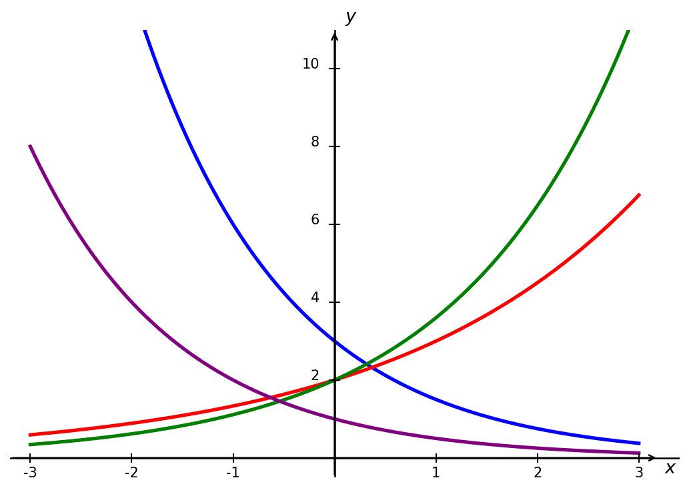
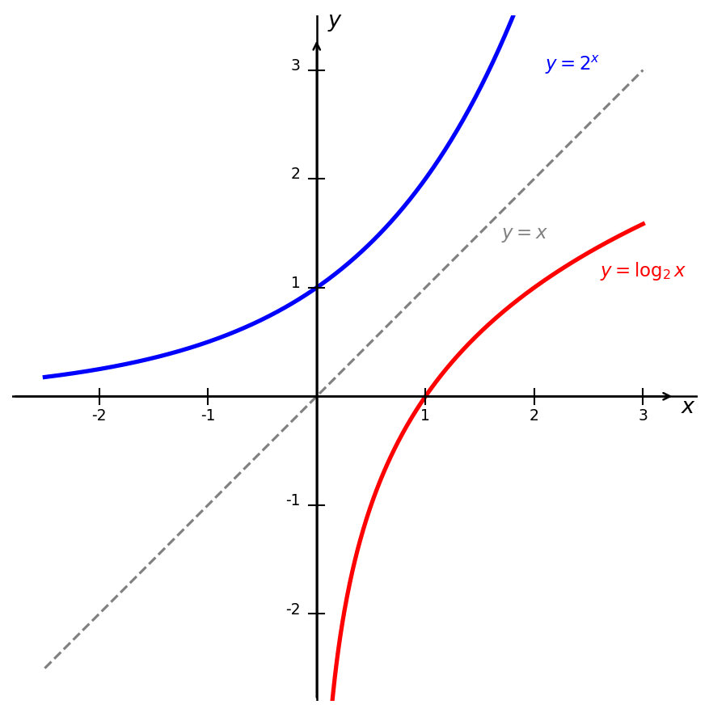
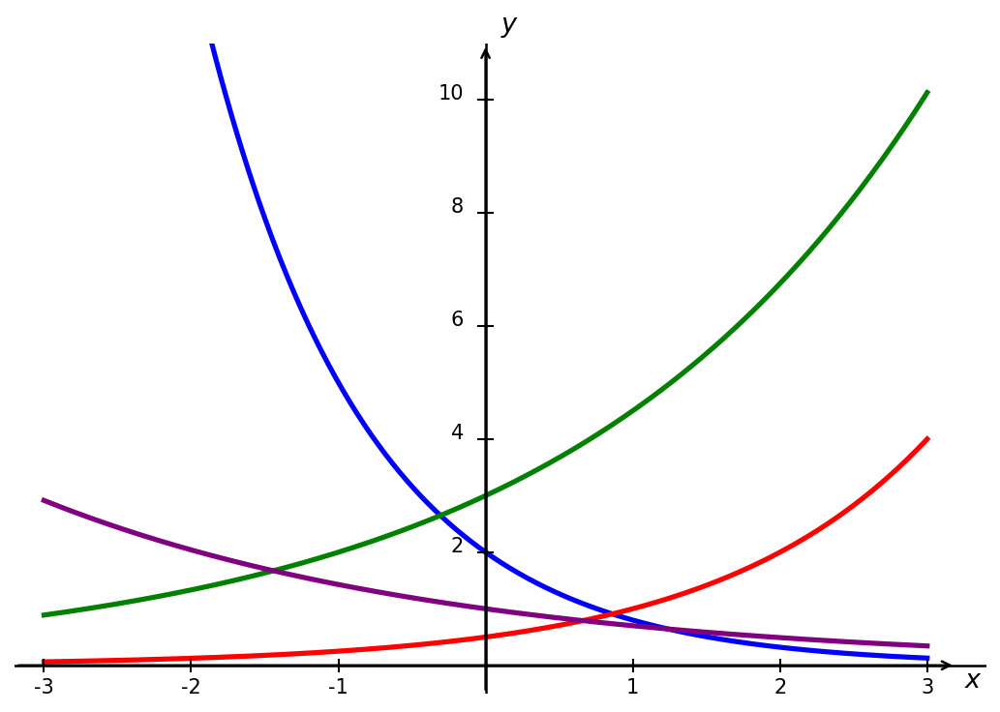

# 4. Exponents and Logarithms

## 4.1 Review of Exponents

!!! note "Properties of Exponents"
    All variables represent real numbers. And assume all variables in the denominator are non-zero. 

    1. $x^a\cdot x^b = x^{a+b}$
    2. $\frac{x^a}{x^b} = x^{a-b}$
    3. $(x^a)^b = x^{ab}$
    4. $(xy)^a = x^ay^a$
    5. $\left(\frac{x}{y}\right)^a = \frac{x^a}{y^a}$
    6. $x^0 = 1$, provided $x \neq 0$
    7. $x^{-a} = \frac{1}{x^a}$, provided $x \neq 0$
    8. $x^{1/n} = \sqrt[n]{x}$, provided $x \neq 0$

!!! example "Example 1"
    Simplify $x^3 \cdot x^5$.

    ??? success "Solution"
        When multiplying expressions with the same base we add the exponents,

        $$x^3 \cdot x^5 = x^{3+5} = x^8$$

!!! example "Example 2"
    Simplify $\dfrac{x^6 y^3}{x^2 y}$.

    ??? success "Solution"
        When dividing expressions with the same base we subtract the exponents,

        $$\frac{x^6 y^3}{x^2 y} = x^{6-2} y^{3-1} = x^4 y^2$$

!!! example "Example 3"
    Simplify $\left(\dfrac{2x^3}{y^2}\right)^4$.

    ??? success "Solution"
        Apply the exponent to each factor inside the parentheses,

        $$\left(\frac{2x^3}{y^2}\right)^4 = \frac{2^4 x^{3 \cdot 4}}{y^{2 \cdot 4}} = \frac{16x^{12}}{y^8}$$

!!! example "Example 4"
    Simplify $\dfrac{(3x^2 y)^3}{9x^4 y^{-2}}$.

    ??? success "Solution"
        First expand the numerator,

        $$(3x^2 y)^3 = 3^3 x^{2 \cdot 3} y^3 = 27x^6 y^3$$

        Now divide,

        $$\frac{27x^6 y^3}{9x^4 y^{-2}} = 3x^{6-4} y^{3-(-2)} = 3x^2 y^5$$

## 4.2 Exponential Functions

Suppose a population of bunnies starts off with 2 bunnies and every month the population doubles. We can create a table illustrating the growth, 

| Month | No. of Bunnies |
| :---: | :------------: |
| 0     | 2              |
| 1     | 4              |
| 2     | 8              |
| 3     | 16             |

This type of growth is known as **exponential** growth. The plot is shown below.

<iframe src="https://www.desmos.com/calculator/urmvmisejf?embed" width="400" height="400" style="border: 1px solid #ccc" frameborder=0></iframe>

The function above has the form $y = 2\cdot2^x$. In general, exponential functions have the form

$$f(x) = a \cdot b^x,$$

where $a$ is the initial value and $b$ is the growth/decay factor. We will always assume $b > 0$. If $b > 1$, the function represents exponential **growth** and looks like the graph above. If $0 < b < 1$, the function represents exponential **decay**. Below is a graph of the function $y = (1/2)^x$, 

<iframe src="https://www.desmos.com/calculator/wnjnykncem?embed" width="400" height="400" style="border: 1px solid #ccc" frameborder=0></iframe>

Many real life processes are modeled by exponential growth and decay. Below are a few common examples.

!!! example "Example 5"
    India’s population was 1.14 billion in the year 2008 and is growing by about 1.34% each year. Write an exponential function for India’s population, and use it to predict the population in 2020.

    ??? success "Solution"
        In this problem we are given the *growth rate* as a percentage. We must convert this to a multiplier to use the about function formula. Note that 

        $$b = 1+r$$

        where $r$ is the growth rate *as a decimal*. Thus $b = 1 + 0.0134 = 1.0134$ and the population (in billions) is given by the function 

        $$P(t) = 1.14\cdot 1.0134^t$$

        where $t$ is the number of year since 2008. Thus the estimated population in 2020 is, 

        $$P = 1.14 \cdot 1.0134^{12} = 1.337 \text{ billion people}.$$

!!! example "Example 6"
    A savings account has an annual interest rate of 3.45% compounded monthly. If Julia deposits $500 how much money will she have after 2 years. 

    ??? success "Solution"
        There are a few key phrases we should understand here. Firstly, the interest is compounded monthly, meaning our times should be the number of months that have passed. Secondly, we are given an *annual* interest rate, so to convert this to a monthy rate we need to divide by 12. Thus,

        $$b = 1 + \frac{0.0345}{12} = 1.002875$$

        And we have the function, 

        $$f(t) = 500\cdot 1.002875^t.$$

        Plugging in $t = 24$ (2 years = 24 months) we get, 

        $$f(24) = 500 \cdot 1.002875^{24} = \$535.67.$$

!!! example "Example 7"
    A car purchased for $\$28{,}000$ depreciates at a rate of 15% per year. 

    (a) Write an exponential function modeling the value of the car after $t$ years.

    (b) Find the value of the car after 5 years.

    ??? success "Solution"
        a) If we are given a *decay rate*, like above, then 
        
        $$b = 1 - r$$

        where $r$ is the decay rate (as a decimal again). Since the car loses 15% of its value each year, then $b = 0.85$. The value after $t$ years is,

        $$V(t) = 28000(0.85)^t$$

        b) After 5 years,

        $$V(5) = 28000(0.85)^5 = 28000(0.4437) = \$12{,}424.$$

!!! example "Example 8"
    Bismuth-210 is an isotope that radioactively decays by about 13% each day, meaning 13% of the remaining Bismuth-210 transforms into another atom (polonium-210 in this case) each day. If you begin with 100 mg of Bismuth-210, how much remains after one week?

    ??? success "Solution"

    We can write a function to represent the decay, 

    $$f(t) = 100 \cdot 0.87^t,$$

    where $t$ is in days. After a week we have, 

    $$f(7) = 100 \cdot 0.87^7 = 37.73 \text{ mg}.$$

### 4.2.1 Euler's Number 

Let's consider a similar set up to Example 6. Suppose we deposit $D$ dollars into an account with an annual interest rate $r$. In Example 6 we considered interest compounded *monthy*, but here let's consider interest compounded over different length of time. For interest compounded $n$ times the amount of money in the account after $t$ years is, 

$$f(t) = D \left(1+\frac{r}{n}\right)^{nt}$$

Let's see what happens to the multiplier $\left(1+\frac{r}{n}\right)^n$ as $n$ increases, e.g. interest is compounded more frequently. 

| $n$ | $\left(1 + \frac{1}{n}\right)^n$ |
|-----|----------------------------------|
| $1$ | $2$ |
| $5$ | $2.48832$ |
| $10$ | $2.59374$ |
| $25$ | $2.66584$ |
| $50$ | $2.69159$ |
| $100$ | $2.70481$ |
| $1{,}000$ | $2.71692$ |
| $10{,}000$ | $2.71815$ |
| $20{,}000$ | $2.71821$ |
| $50{,}000$ | $2.71826$ |

Notice that as $n$ increase, the multiplier seems to be approaching $\approx 2.718$. The precise number is a **transcendental** number called Euler's number. We use the symbol $e$ to denote Euler's number and, as shown above, 

$$e \approx 2.718282.$$

Sometimes calculators and computer programs use the notation $\exp(x) = e^x$. We say a function represents **continuous (exponential) growth** if it has the form, 

$$f(x) = ae^{rx}$$

where $a$ is the initial condition and $r$ is the *continuous growth rate* (as a decimal), which is typically given as a percent per time interval (e.g. day, month, year). 

!!! example "Example 9"
    Radon-222 decays at a continuous rate of 17.3% per day. How much will 100mg of Radon-222 decay to in 3 days?

    ??? success "Solution"
        When dealing with *decay* the continuous growth rate is negative. In this case the amount of Radon-222 is modeled by the function, 

        $$f(t) = 100e^{-0.173t}$$

        where $t$ is in days, since the continuous growth rate is written as "per day." After 3 days we get, 

        $$f(3) = 100e^{-0.173(3)} = 59.512 \text{ mg}.$$

### 4.2.2 Graphs of Exponential Functions

When sketching the graph of an exponential function $f(x) = a\cdot b^x$, it is helpful to remember the graph passes through the points $(0,a)$ and $(1,ab)$. If $a > 0$, then the function has the following long run behavior:

- If $b > 1$, as $x \to \infty$, $f(x) \to \infty$ and as $x \to -\infty$, $f(x) \to 0$. 
- If $0 < b < 1$, as $x \to \infty$, $f(x) \to 0$ and as $x \to -\infty$, $f(x) \to \infty$. 

!!! example "Example 10"
    Match each equation to the correct graph, 

    - $f(x) = 3(0.5)^x$
    - $g(x) = 2(1.5)^x$
    - $h(x) = 2(1.8)^x$
    - $k(x) = 1(0.5)^x$

    

    {width="400"}
    

    ??? success "Solution"
        The key to matching is to look at two things: the y-intercept and whether the function is growing or decaying.

        - $f(x) = 3(0.5)^x$ — y-intercept of $3$, decaying. This is the **blue** curve.
        - $g(x) = 2(1.5)^x$ — y-intercept of $2$, growing but slowly. This is the **red** curve.
        - $h(x) = 2(1.8)^x$ — y-intercept of $2$, growing faster than $g$. This is the **green** curve.
        - $k(x) = 1(0.5)^x$ — y-intercept of $1$, decaying. This is the **purple** curve.

        Note that $f$ and $k$ both decay at the same rate since they share the same base, but $f$ starts higher because its y-intercept is $3$ rather than $1$. Similarly, $g$ and $h$ both grow but $h$ grows faster since $1.8 > 1.5$.

Exponential growth functions grow *faster* than ALL polynomial functions. This can be hard to see with a graph, since these functions get large very fast. A table can help us observe this fact though,

| $x$ | $e^x$ | $x^2 + 1$ | $x^3 + 1$ | $x^{10} + 1$ |
|-----|-------|-----------|-----------|--------------|
| $1$ | $2.718$ | $2$ | $2$ | $2$ |
| $5$ | $148.413$ | $26$ | $126$ | $9{,}765{,}626$ |
| $10$ | $22{,}026$ | $101$ | $1{,}001$ | $10{,}000{,}000{,}001$ |
| $20$ | $485{,}165{,}195$ | $401$ | $8{,}001$ | $\approx 1.024 \times 10^{13}$ |
| $50$ | $\approx 5.185 \times 10^{21}$ | $2{,}501$ | $125{,}001$ | $\approx 9.766 \times 10^{16}$ |
| $100$ | $\approx 2.688 \times 10^{43}$ | $10{,}001$ | $1{,}000{,}001$ | $\approx 10^{20}$ |

Notice that for smaller values of $x$, e.g. $x = 5, \, 10$, the function $y = x^{10} + 1$ is actually much larger than $y = e^x$. However, $y = e^x$ eventually catches up and passes $y = x^{10} + 1$ for good. 

!!! note "Scientific Notation"
    When working with very large or very small numbers it is convenient to use **scientific notation**. A number is written in scientific notation as

    $$a \times 10^n$$

    where $1 \leq a < 10$ and $n$ is an integer. For example,

    $$3{,}200{,}000 = 3.2 \times 10^6 \qquad 0.000047 = 4.7 \times 10^{-5}$$

    A positive exponent moves the decimal point to the right, and a negative exponent moves it to the left. The exponent tells you how many places the decimal point has moved.

## 4.3 Logarithmic Functions

The **logarithm** with base $b$, $\log_b(x)$, is the inverse of the exponential function, $b^x$. This means the statement $b^x = y$ is equivalent to the statement $\log_b(y) = x$. We will only consider $b > 0$. We can only compute the logarithm of positive numbers, this is equivalent to the fact that the $b^x > 0$ ($b > 0$).

!!! example "Example 11"
    Without using a calculator, compute $\log_2(16)$. 

    ??? success "Solution"
        Say $\log_2(16) = x$, then it must also be true that $2^x = 16$. Observing that $16=2^4$, we determine that $x=4$. 

!!! example "Example 12"
    Without using a calculator, compute $\log_3(81)$.

    ??? success "Solution"
        Say $\log_3(81) = x$, then it must also be true that $3^x = 81$. Observing that $81 = 3^4$, we determine that $x = 4$.

Since logarithms and exponentials are **inverse function** we can graph the logarithm function $f(x) = \log_b(x)$ by flipping the function $g(x) = b^x$ across the line $y = x$. 

{width="400"}

We should notice that:

- $\log_b(1) = 0$.
- The logarithm function has a **vertical asymptote** at $x = 0$.
- As $x\to\infty$, $\log_b(x) \to \infty$.

The last point may not be obvious from the graph of the logarithm. This is because exponential functions grow very *slowly*, in fact, they grow slower than lines. 

The **natural logarithm** is the logarithm with base $e$. Typically the notation $ln(x)$ is used to denote the natural logarithm. a logarithm with no indicated base, $\log(x)$, means different things to different people:

- A lot of sources will tell you $\log(x)$ means the logarithm base 10. This is true for engineers, chemists, and many calculators. 
- Mathematicians use $\log(x)$ to mean the natural logarithm. 
- Computer scientists use $\log(x)$ to mean the logarithm base 2.

If context is not clear, you should be careful as to which logarithm is being used. Logarithms of different bases can be related with a simple transformation:

$$\log_b(x) = \frac{\log_a(x)}{\log_a(b)}.$$

Some other important properties of logarithms are:

1. $\log_b (x^t) = t \log_b(x)$
2. $\log_b(xy) = \log_b(x) + \log_b(y)$
3. $\log_b(x/y) = \log_b(x) - \log_b(y)$

Logarithms are useful when solving for unknowns in exponential equations. 

!!! example "Example 13"
    In Example 7, we determined that the value of a car after $t$ years was given by,

    $$V(t) = 28000(0.85)^t.$$

    After how many years will the car only be worth $10,000?

    ??? success "Solution"
        We wish to solve for $t$, where

        $$10000 = 28000(0.85)^t.$$

        First, we want to isolate the exponential

        $$0.357 = 0.85^t$$

        Next, take the log base 0.85 of both sides

        $$\log_{0.85}(0.357) = \log_{0.85}(0.85^t)$$

        Since logarithms and exponential are inverse, the right side simplifies, 

        $$\log_{0.85}(0.357) = t$$

        Using a calculator we get, $t \approx 6.3378$ years.

!!! example "Example 14"
    A population of bacteria grows continuously at a rate of 8% per hour. The initial population is 1,000 bacteria. How long will it take for the population to reach 5,000 bacteria?

    ??? success "Solution"
        Using the continuous growth model,

        $$P(t) = a e^{rt}$$

        we have $a = 1000$ and $r = 0.08$. We want to find $t$ such that $P(t) = 5000$,

        $$5000 = 1000e^{0.08t}$$

        Divide both sides by $1000$,

        $$5 = e^{0.08t}$$

        Take the natural log of both sides,

        $$\ln(5) = \ln(e^{0.08t})$$

        Using the property $\ln(e^x) = x$,

        $$\ln(5) = 0.08t$$

        Solve for $t$,

        $$t = \frac{\ln(5)}{0.08} \approx 20.1 \text{ hours}.$$

## Exercises 

### 4.1 Exercises

Simplify the following expressions using the properties of exponents. The simplified form should have no negative exponents. 

- **Problem 1.**

    $\dfrac{x^5}{x^{-2}}$

- **Problem 2.**

    $(3x^{-2} y^3)^2$

- **Problem 3.**

    $\dfrac{x^3 y^{-2}}{x^{-1} y^3}$

- **Problem 4.**

    $\left(\dfrac{2x^{-1} y^2}{z^3}\right)^{-2}$

- **Problem 5.**

    $\dfrac{(3x^2 y)^3}{9x^{-1} y^4}$

- **Problem 6.**

    $\left(\dfrac{x^3 y^{-1}}{x^{-2} y^2}\right)^3$

- **Problem 7.**

    $\dfrac{(2x y^{-2})^3 \cdot x^{-1}}{4x^2 y}$

- **Problem 8.**

    $\left(\dfrac{4x^{-2} y^3}{2x y^{-1}}\right)^{-2}$

### 4.2 Exercises 

**Problem 9.** Match each equation to the correct graph.

- $f(x) = 2(0.4)^x$
- $g(x) = 0.5(2)^x$
- $h(x) = 3(1.5)^x$
- $k(x) = 1(0.7)^x$

{width="400"}

Sketch a graph of the following exponential functions. Label the y-intercept and state whether the function is growing or decaying.

- **Problem 10.**

    $f(x) = 2^x$

- **Problem 11.**

    $f(x) = 3(0.5)^x$

- **Problem 12.**

    $f(x) = -2(1.4)^x$

- **Problem 13.**

    $f(x) = 4e^x$

**Problem 14.** A town has a population of $8{,}000$ people and is growing at a rate of $4\%$ per year. Write an exponential function modeling the population after $t$ years. What will the population be after $10$ years?

**Problem 15.** A laptop purchased for $\$1{,}200$ loses $20\%$ of its value each year. Write an exponential function modeling the value of the laptop after $t$ years. What is it worth after $3$ years?

**Problem 16.** A bacteria culture starts with $500$ bacteria and doubles every $4$ hours. Write an exponential function modeling the number of bacteria after $t$ hours. How many bacteria are present after $12$ hours?

**Problem 17.** A city had a population of $50{,}000$ in 2010 and grew continuously at a rate of $3\%$ per year. Find the population in 2020.

**Problem 18.** A radioactive substance decays continuously at a rate of $5\%$ per year. A sample initially contains $200$ grams. How much of the substance remains after $6$ years?

Determine whether the following statements are true or false. Briefly justify your answer. 

- **Problem 19.**

    As $x \to \infty$, $e^x \to \infty$.

- **Problem 20.**

    The function $f(x) = 3(0.8)^x$ is negative for negative values of $x$.

- **Problem 21.**

    As $x \to \infty$, $e^x > x^5$ for all $x$.

- **Problem 22.**

    All exponential functions of the form $f(x) = ab^x$ pass through the point $(0, a)$.

### 4.3 Exercises

Answer the following questions *without* the use of a calculator or graphing utility. 

**Problem 23.** Compute $\log_2 (8)$. 

**Problem 24.** Compute $\log_3 (27)$.

**Problem 25.** What is the *domain* of the function $y = \ln (x)$. 

**Problem 26.** Which is greater: $\log_3 (10)$ or $\log_5(10)$?

Determine whether the following statements are true or false. Briefly justify your answer. 

- **Problem 27.**

    As $x \to \infty$, $\log_{10}(x) \to \infty$.

- **Problem 28.**

    $f(x) = \ln(x)$ has a horizontal asymptote at $x = 0$.

- **Problem 29.**

    The graph of $y=\log_2(x)$ is always concave down. 

- **Problem 30.**

    $\log_b(b) = 1$ for all $b > 0$. 

**Problem 31.** A city had a population of $120{,}000$ in 2015 and grows continuously at a rate of $2.5\%$ per year. In what year will the population reach $200{,}000$?

**Problem 32.** A car purchased for $\$35{,}000$ depreciates at a continuous rate of $12\%$ per year. How long until the car is worth $\$15{,}000$?

**Problem 33.** A social media account has $500$ followers and gains followers continuously at a rate of $15\%$ per month. How many months until the account reaches $10{,}000$ followers?

**Problem 34.** A radioactive substance has a continuous decay rate of $3\%$ per year. A lab starts with $800$ grams of the substance. How long until only $100$ grams remain?
