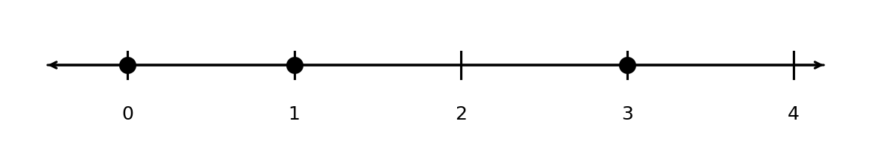
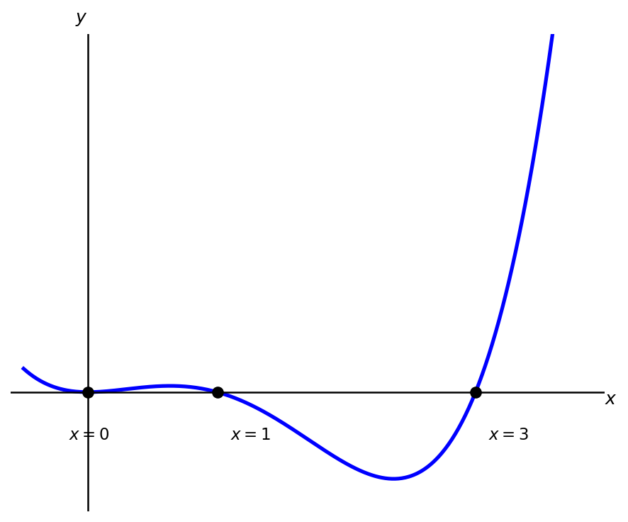

# 3. Quadratics, Polynomials, and Rational Functions

## 3.1 Quandratic Functions 

A **quadratic** is a function which has the form $y = ax^2 + bx + c$ where $a$, $b$, and $c$ are constants and $a \neq 0$ (A quadratic must have an $x^2$ term, or else its just a line!). The shape of the graph of a quadratic is called a **parabola**. Below is a graph of the function $y = x^2$, 

<iframe src="https://www.desmos.com/calculator/1gfptpwfpv?embed" width="300" height="300" style="border: 1px solid #ccc" frameborder=0></iframe>

Parabolas have a U-like shape. Depending on the *sign* of the coefficient $a$, the U may face up (like above) or down. Below is a graph of the quadratic $y = -2x^2 + 3$, which faces down since $a = -2$ is negative. 

<iframe src="https://www.desmos.com/calculator/4rbbypdlyz?embed" width="300" height="300" style="border: 1px solid #ccc" frameborder=0></iframe>

The **vertex** of a quadratic is the highest (if facing down) or lowest (if facing up) point on the graph. Let $(h,k)$ denote the vertex. Then, 

$$h = -\frac{b}{2a}$$

!!! example "Example 1"
    Compute the vertex of the quadratic $y = x^2 - 3x + 2$. 

    ??? success "Solution"
        Since $a = 1$ and $b = -3$, the $x$-coordinate of the vertex is given by 

        $$h = -\frac{-3}{2(1)} = \frac{3}{2}.$$

        To compute the $y$-coordinate, we plug the above into the quadratic function 

        $$k = \left(\frac{3}{2}\right)^2 - 3\left(\frac{3}{2}\right) + 2 = \frac{9}{4} - \frac{9}{2} + 2 = -\frac{1}{4}.$$

        Thus the vertex is at $(3/2,-1/4)$. 

A quadratic function with vertex $(h,k)$ is **symmetric** about the vertical line $x=h$. This means I can flip the graph about this line and the picture is unchanged. 

The places where the parabola crosses the $x$-axes are known as the **zeros** or roots of the function. A quadratic function may have 0, 1, or 2 zeros. The above graphs show examples of 1 and 2 zeros. Below we give an example where there are no zeros:

<iframe src="https://www.desmos.com/calculator/6hbrmdreua?embed" width="300" height="300" style="border: 1px solid #ccc" frameborder=0></iframe>

To find the zeros of a quadratic function one can *factor* the expression or use the *quadratic formula*. 

Let's start by factoring when $a = 1$. In this case, we are looking to rewrite the quadratic in the following way, 

$$x^2 + bx + c = (x + p)(x + q)$$

where $-p$ and $-q$ are the zeros of the function. For example, 

$$x^2 + 4x + 3 = (x + 3)(x + 1)$$

so the zeros of $x^2 + 4x + 3$ are $-3$ and $-1$. We can check the sides above are equal by multiplying out the right side (Make sure you FOIL!),

$$(x + 3)(x + 1) = x(x+1) + 3(x+1) = x^2 + x + 3x + 3 = x^2 + 4x + 3. \;\checkmark$$

When $a = 1$ and $b$ and $c$ are *integers*, the following information will help us factor:

- $p$ and $q$ are integers,
- $p q = c$,
- $p + q = b$.

In this case, I like listing out the integer factors of $c$, and then checking which satisfy the last condition. 

!!! example "Example 2"
    Find the zeros of the quadratic $y = x^2 + 5x + 6$ by factoring

    ??? success "Solution"
        The integer factors of $6$ are: $1$ and $6$, $2$ and $3$. We want to choose the pair that adds up to $5$, which is $2$ and $3$. Thus,

        $$x^2 + 5x + 6 = (x+2)(x+3)$$

        so the zeros are $-2$ and $-3$.

!!! example "Example 3"
    Find the zeros of the quadratic $y = x^2 - 4x - 45$ by factoring

    ??? success "Solution"
        The integer factors of 45 are: 

        - 1, 45
        - 3, 15
        - 5, 9

        In this example we have to be careful about signs. Since $c = -45$, one of the factors needs to come with a negative sign. We can check that $5 - 9 = -4 = b$, so the correct factorization is

        $$y = (x - 9)(x+5)$$

        and the zeros are $x = 9, \, -5$. 

If $a \neq 1$, factoring becomes a bit more complicated. In this case we need to write, 

$$ax^2 + bx + c = (sx + p)(tx + q).$$

In this case, the zeros are given by $-p/s$ and $-q/t$. As long as $a$, $b$, and $c$ are integers we use the following infomation to help us factor:

- $s$, $t$, $p$, and $q$ are all integers,
- $st = a$,
- $pq = c$,
- and $sq + pt = b$. 

From this information we can make an educated guess at what the appropriate factoring is and then check if it works by FOIL-ing out the guess. 

!!! example "Example 4"
    Factor the quadratic $y = 3x^2 + 5x + 2$ and solve for the zeros. 

    ??? success "Solution"
        Since $a = 3$ only factors into 3 and 1 and $c = 2$ only factors into 2 and 1, there are only two possible factorizations, 

        $$(3x+1)(x+2) \text{ and } (3x+2)(x+1)$$

        By FOIL-ing we can deduce the latter is correct, 

        $$(3x+2)(x+1) = 3x(x+1) + 2(x+1) = 3x^2+3x+2x+2 = 3x^2+5x+2.$$

        The zeros are then $x = -1,\, -2/3$. 

The **quadratic formula** states that the solution to $ax^2 + bx + c = 0$ is, 

$$x = \frac{-b \pm \sqrt{b^2 - 4ac}}{2a}.$$

The $\pm$ symbol indicates that one solution is given by using $+$ and another solution is given by using $-$. If there are no roots of the equation the term under the square root, $b^2 - 4ac$, will be negative. If there is a single root $b^2 - 4ac = 0$. The term $b^2-4ac$ is sometimes referred to as the discriminant. 

!!! example "Example 5"
    Use the quadratic formula to find the zeros of $y = 3x^2 + 5x + 2$.

    ??? success "Solution"

        The quadratic formula gives, 

        $$x = \frac{-5 \pm \sqrt{25 - 4(3)(2)}}{2(3)}.$$

        Simplifying we get, 

        $$x = \frac{-5 \pm \sqrt{25 - 24}}{6} = -\frac{5}{6} \pm \frac{1}{6}.$$

        So the roots are $x = -1, \, -2/3$. 

If the quadratic has irrational roots factoring will not work, but the quadratic formula will 

!!! example "Example 6"
    Use the quadratic formula to compute the zeros of $y = x^2 + 4x - 6$.

Quadratic functions show up in many applications. The seminal example is projectile motion, 

!!! example "Example 7"
    A ball is thrown upwards from the top of a 40 ft high building at a speed of 80 ft/s. The balls height above the ground can be modeled by the equation

    $$h = -16t^2 + 80t +40$$

    where $t$ is the number of seconds after the ball is thrown. When does the ball hit the ground?

    ??? success "Solution"
        We want to compute the zeros of the function $h = -16t^2 + 80t +40$ so let's use the quadratic formula, 

        $$t = \frac{-80 \pm \sqrt{6400 - 4(-16)(40)}}{2(-16)} = \frac{-80 \pm \sqrt{8960}}{-32}$$

        Since the square root does not simplify nicely, we can use a calculator to approximate the solution

        $$t \approx 5.458, \; -0.458.$$

        Since it doesn't make sense to have negative time, the correct answer is $5.458$ seconds. 

!!! example "Example 8"
    The weekly demand for a product is given by $q = 300 - 5p$, where $p$ is the price in dollars and $q$ is the quantity demanded. Find the price that maximizes weekly revenue.

    ??? success "Solution"
        Revenue is price times quantity,

        $$R = pq = p(300 - 5p) = 300p - 5p^2$$

        This is a downward-opening parabola, so the maximum occurs at the vertex,

        $$p = -\frac{300}{2(-5)} = 30$$

        The maximum revenue is

        $$R(30) = 300(30) - 5(30)^2 = 9000 - 4500 = 4500$$

        A price of $\$30$ per unit maximizes weekly revenue at $\$4500$.
    

## 3.2 Polynomial Functions

A **polynomial** is a function that can be written as 

$$y = a_nx^n + a_{n-1}x^{n-1} + \cdots + a_1 x + a_0$$

where $a_i$ are coefficients. We assume $a_n \neq 0$, but the other $a_i$ can be any real number. The **degree** of a polynomial is the highest power of $x$ appearing in the function. As written, the above polynomial has degree $n$. 

!!! example "Example 9"
    Determine the degree of the following polynomials:

    a) $y = x^2 + x + 1$

    b) $y = 3x^3 + 2x^2 + 1$

    c) $y = x - 4x^5$

    ??? success "Solution"
        
        a) $y = x^2 + x + 1$ has degree $2$.

        b) $y = 3x^3 + 2x^2 + 1$ has degree $3$.

        c) $y = x - 4x^5$ has degree $5$.

A line is a polynomial of degree 1 or 0 (a degree 0 polynomial is a horizontal line). A quadratic is a polynomial of degree 2. 

A polynomial of degree $n$ can cross the $x$ axis up to $n$ times. Like quadratics, we can factor polynomials. Factoring polynomials is typically a process of trial and error. There is no generalization of the quadratic formula for degree $n$ polynomials. 

!!! note "Solving for Zeros in Higher Degrees"
    There are formulas that solve for zeros of <a href="https://en.wikipedia.org/wiki/Cubic_equation">cubic</a> (degree 3) and <a href="https://en.wikipedia.org/wiki/Quartic_equation">quartic</a> (degree 4) polynomials. The **Abel-Ruffini Theorem** proves there is no closed expression for the zeros in degree 5 or above. 

    In this class we will only care about routine factoring of higher order polynomials, for anything complicated I suggest using a computer :).

!!! example "Example 10"
    Factor $y = 3x^4 - 12x^3 + 9x^2$.

    ??? success "Solution"
        First factor out the greatest common factor of $3x^2$,

        $$3x^4 - 12x^3 + 9x^2 = 3x^2(x^2 - 4x + 3)$$

        The remaining quadratic factors as,

        $$3x^2(x^2 - 4x + 3) = 3x^2(x-1)(x-3)$$

        The zeros are $x = 0$, $x = 1$, and $x = 3$.

!!! example "Example 11"
    Factor $y = x^3 + 2x^2 - 9x - 18$.

    This problem uses a method called *grouping* for more on gouping see <a href="https://math.libretexts.org/Bookshelves/Algebra/Elementary_Algebra_(Ellis_and_Burzynski)/06%3A_Factoring_Polynomials/6.05%3A_Factoring_by_Grouping">this online resource</a>.

    ??? success "Solution"
        Group the first two and last two terms,

        $$x^3 + 2x^2 - 9x - 18 = (x^3 + 2x^2) + (-9x - 18)$$

        Factor out the common factor from each group,

        $$= x^2(x + 2) - 9(x + 2)$$

        Now factor out $(x+2)$,

        $$= (x + 2)(x^2 - 9)$$

        The quadratic $x^2 - 9$ is a difference of squares, so,

        $$= (x+2)(x+3)(x-3)$$

        The zeros are $x = -2$, $x = -3$, and $x = 3$.

The **tail behavior** describes what happens to a graph as $x \to \infty$ and $x \to -\infty$. The two tails can either go up or down. The tail behavior is determined by the highest degree term, $a_nx^n$:

|           | $n$ is even | $n$ is odd |
| --------- | :---------: | :--------: |
| $a_n > 0$ | up, up.     | down, up.  |
| $a_n < 0$ | down, down. | up, down.  |

In the above table we list the direction of the $-\infty$ tail then the $\infty$ tail (like you would read the graph from left to right).

Given a factored polynomial, we can sketch a good picture by determining whether the function is above or below the $x$-axis between the roots. 

!!! example "Example 12"
    Sketch the polynomial $y = 3x^4 - 12x^3 + 9x^2$.

    ??? success "Solution"
        We factored this polynomial in Example 10 and got, 

        $$y = 3x^2(x-1)(x-3)$$

        Let's put the zeros on a number line:

        

        {width="500"}
        

        In between the zeros the polynomial will be entirely positive or entirely negative, so we just need to check a single point in each interval.

        $x < 0$: Let's check $x = -1$, 

        $$3(-1)^2(-1-1)(-1-3) = 3(1)(-2)(-4) = 24$$

        so the function is positive when $x < 0$. 

        $0 < x < 1$: Let's check $x = 1/2$,

        $$3(1/2)^2(1/2-1)(1/2-3) = 3(1/4)(-1/2)(-5/2) = 15/16$$

        so the function is positive when $0 < x < 1$. 

        $1<x<3$: Let's check $x=2$,

        $$3(2)^2(2-1)(2-3) = 3(4)(1)(-1) = -12$$

        so the function is negative when $1<x<3$.

        $x > 3$: Let's check $x = 4$, 

        $$3(4)^2(4-1)(4-3) = 3(16)(3)(1) = 144$$

        so the function is positive when $x > 3$.

        Notice the leading term of this polynomial is $3x^4$, so the tail behavior checks out with what we determined above. From this information we get a nice sketch of the graph.  

        

        {width="400"}
        

## 3.3 Rational Functions 

If $p(x)$ and $q(x)$ are polynomial functions, then 

$$y = \frac{p(x)}{q(x)}$$

is a **rational** function. 

!!! note "Function Notation"
    It is common to use the notation $f(x) = y$ to denote that $y$ is a function of $x$. The letter $f$ is typically used to mean function, however in some context it is common to use other letters. For example, $p$ and $q$ are commonly used to represent polynomials. If we write 

    $$f(x) = 3x + 1$$

    means the same as 

    $$y = 3x + 1.$$

    The left hand side above *does not* mean we are multiplying $f$ by $x$. If we write, 

    $$f(1) = 4$$

    This means that when $x = 1$ we have $y = 4$. 

Rational functions may have **vertical asymptotes**. These are $x$-values where the function tends to infinity. This means that near these points the function looks like a vertical line. Consider the graph of the function, 

$$y = \frac{1}{x}$$

Using Desmos we get, 

<iframe src="https://www.desmos.com/calculator/dfhxt8nnmp?embed" width="400" height="400" style="border: 1px solid #ccc" frameborder=0></iframe>

This graph has a vertical asymptote at $x = 0$. Vertical asymptotes occur when the polynomial in the denominator is equal to 0, however not all zeros of the denominator result in vertical asymptotes. Let's consider the following function

$$y = \frac{x^2-1}{x^2+4x+3}$$

factoring the denominator gives, 

$$y = \frac{x^2-1}{(x+1)(x+3)}$$

so there are potentially vertical asymptotes at $x=-1$ and $x=-3$. When we graph the function using Desmos we get, 

<iframe src="https://www.desmos.com/calculator/mhkbc1f7nm?embed" width="400" height="400" style="border: 1px solid #ccc" frameborder=0></iframe>

The above graph shows a vertical asymptote at $x=-3$ but *no* vertical asymptote at $x=-1$. Desmos is correct, there is no vertical asymptote, however it is misleading. We call $x=-1$ a **removable discontinuity** or hole in the graph. This is because if we also factor the numerator we get

$$y = \frac{(x-1)(x+1)}{(x+1)(x+3)}$$

and the $x-1$ terms in the numerator and denominator cancel each other out. In short, $x=k$ is 

1. a vertical asymptote if $q(k) = 0$ and it does not cancel out with terms from the numerator.
2. a removable discontinuity if $q(k) = 0$ but the term cancels out with terms in the numerator. 

The numerator and denominator should be *fully factored* in order to determine what is a vertical asymptote and what is a removable discontinuity. 

!!! example "Example 13"
    Determine whether the following function has any vertical asymptotes or removable discontinuities,

    $$f(x) = \frac{x^2 - x - 6}{x^2 - x - 2}$$

    ??? success "Solution"
        First factor the numerator and denominator,

        $$f(x) = \frac{(x-3)(x+2)}{(x-2)(x+1)}$$

        The function has vertical asymptotes at $x = 2$ and $x = -1$, and no removable discontinuities.

The tails of a polynomial always go to $\infty$ or $-\infty$ as long as the degree of the polynomial is at least 1. For rational functions the tail, or **asymptotic**, behavior depends on the higest degree in the numerator and denominator of the function. If $\deg p(x) \leq \deg q(x)$ the function has a **horizontal asymptote**. A horizontal asymptote means that as $x \to \pm \infty$ the function begins to look like a horizontal line. Both of the Desmos graphs above have horizontal asymptotes. 

1. If $\deg p(x) < \deg q(x)$, then the rational function has a horizontal asymptote at $y = 0$. 

2. If $\deg p(x) = \deg q(x)$, then the rational function has a horizontal asymptote that depends on the coefficients associated to the leading order terms. See the example below. 

!!! example "Example 14" 
    Determine whether the function 

    $$y = \frac{2x^2 - 3}{3x^2 + 2x - 1}$$

    has a horizontal asymptote. 

    ??? success "Solution"

        The degree of the numerator and denominator is 2, so there is a horizontal asymptote. To compute its location, we take the ratio of the coefficients on the $x^2$ terms. Thus the horizontal asymptote is $y = 2/3$. 

Rational function arise naturally in applications 

!!! example "Example 15"
    A large mixing tank currently contains 100 gallons of water, into which 5 pounds of sugar have been mixed. A tap will open pouring 10 gallons per minute of water into the tank at the same time sugar is poured into the tank at a rate of 1 pound per minute. Find the concentration (pounds per gallon) of sugar in the tank after $t$ minutes. Find the horizontal asymptote of this function and interpret its meaning in the context of the problem. 

    ??? success "Solution"
        
        The concentration is amount of sugar divided by the amount of water. After $t$ seconds the amount of sugar and water in the tank are $s = 5 + t$ and $w = 100 + 10t$, respectively. Thus the concentration is given by the rational function

        $$c = \frac{5+t}{100+10t}$$

        The horizontal asymptote occurs at $c = 1/10$. This means that over time, the concentration will eventually level off to $1/10$ lbs sugar per gallon. 

## Exercises

### 3.1 Exercises

Compute the vertex of the following parabolas. State whether the parabola faces up or down. 

- **Problem 1.**

    $y = x^2 + 1$

- **Problem 2.**

    $y = -2x^2 + 3x - 4$

- **Problem 3.**

    $y = 4 - x^2$

- **Problem 4.**

    $y = x^2 + x + 1$ 

Find the zeros of the quadratic functions by factoring. 

- **Problem 5.**

    $y = x^2 + 8x + 12$

- **Problem 6.**

    $y = x^2 - 4x + 4$

- **Problem 7.**

    $y = 6x^2 - x -2$

- **Problem 8.**

    $y = 4x^2 - 12x + 5$

For the following quadratic functions: (a) compute the vertex, (b) find the zeros by factoring or using the quadratic equation, and (c) sketch a graph of the parabola. 

- **Problem 9.**

    $y = x^2 - 4x + 3$

- **Problem 10.**

    $y = x^2 + 2x - 8$

- **Problem 11.**

    $y = -x^2 + 6x - 5$

- **Problem 12.**

    $y = 2x^2 - 7x + 3$

- **Problem 13.**

    $y = -3x^2 + 12x - 9$

- **Problem 14.**

    $y = 4x^2 - 12x + 5$

**Problem 15.** A company finds that if it prices its product at $p$ dollars, the weekly profit is given by

    $$P(p) = -50p^2 + 400p - 300$$

    Find the price that maximizes weekly profit and state the maximum profit.

**Problem 16.** A ball is thrown upward from the top of a 48 foot building with an initial velocity of 32 feet per second. The height of the ball in feet after $t$ seconds is given by

$$h = -16t^2 + 32t + 48$$

(a) Find the maximum height of the ball and the time at which it occurs. (b) Find the time at which the ball hits the ground.

**Problem 17.** The monthly demand for a fitness tracker is given by $q = 500 - 4p$, where $p$ is the price in dollars and $q$ is the quantity demanded. Find the price that maximizes monthly revenue and state the maximum revenue.

### 3.2 Exercises 

Determine the degree and the tail behavior of the following polynomials.

- **Problem 18.**

    $y = x^3 - 10x^2 - x + 1$

- **Problem 19.**

    $y = -2x^4 + 3x^2 - 7$

- **Problem 20.**

    $y = 5x^2 - x + 4$

- **Problem 21.**

    $y = x^5 + 4x^3 - x + 2$

- **Problem 22.**

    $y = 3x^6 - x^4 + 2x - 8$

- **Problem 23.**

    $y = -4x^3 + x^2 + 9$

Factor the following polynomials as much as possible.

- **Problem 24.**

    $y = 2x^3 - 8x^2 - 10x$

- **Problem 25.**

    $y = -3x^4 + 6x^3 + 24x^2$

- **Problem 26.**

    $y = x^3 - 5x^2 + 2x - 10$

- **Problem 27.**

    $y = x^4 - 5x^2 + 4$

Sketch the graph of the following polynomials using the method described in Example 12. Do not use a graphing utility!

- **Problem 28.**

    $y = x(x-2)(x+3)$

- **Problem 29.**

    $y = -x^2(x-4)$

- **Problem 30.**

    $y = (x+1)(x-1)(x-3)(x+2)$

- **Problem 31.**

    $y = -2x(x-3)^2$

### 3.3 Exercises

Determine whether the following rational functions have any vertical asymptotes, removable discontinuities, or horizontal asymptotes.

- **Problem 32.**

    $$f(x) = \frac{x+3}{x-5}$$

- **Problem 33.**

    $$f(x) = \frac{x^2 - 4}{x - 6}$$

- **Problem 34.**

    $$f(x) = \frac{3x^2 + 1}{x^2 - 9}$$

- **Problem 35.**

    $$f(x) = \frac{x^2 - 5x + 6}{x^3 - 2x^2}$$

**Problem 36.** A tank initially contains 50 gallons of water with 2 pounds of salt dissolved in it. Water flows in at a rate of 5 gallons per minute and salt is added at a rate of 3 pounds per minute. Write a function for the concentration of salt (pounds per gallon) after $t$ minutes. Find the horizontal asymptote and interpret its meaning.

**Problem 37.** A new product launches with 500 total sales in its first month. Beginning in month 2, the company runs an advertising campaign that generates 80 new sales per month at a cost of \$200 per month, while fixed operating costs are \$1000 per month. Write a function for the average cost per sale after $t$ months of the campaign. Find the horizontal asymptote and interpret its meaning.

**Problem 38.** A polluted lake contains 1000 gallons of water with 40 pounds of pollutant. A river feeds into the lake at 10 gallons per minute carrying 0.5 pounds of pollutant per gallon, while a drain removes 10 gallons per minute of the mixed water. Write a function for the concentration of pollutant (pounds per gallon) after $t$ minutes. Find the horizontal asymptote and interpret its meaning.